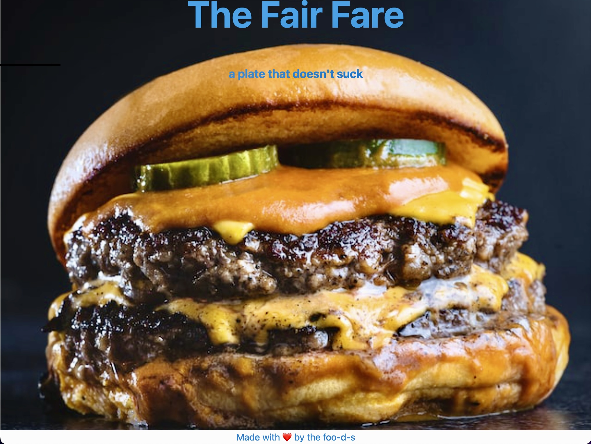

<h1 align="center">The Fair Fare</h1>
  
 
## Table of Contents
- [Description](#description)
- [Installation](#installation)
- [Issues](#issues)
- [User Story](#user_story)
- [Acceptance Criteria](#acceptance_criteria)
- [Usage](#usage)
- [License](#license)
- [Contribution](#contribution)
- [Tests](#tests)
- [Github](#github)
- [Deployed Links](#deployed_links)
- [Credits](#name#github#email)

## Description

 Resturant Rating App for Individual Meals.

 Our task is to create a simple application that allows a user to provide a review of their favorite meals at restaurants that may not have received high ratings for their overall menus.  This application will act as a messageboard for promoting great meals at restaurants that users may have overlooked because of the lower overall restaurant rating.

 This application will use custom API databases to provide updated user reviews.

## Installation

 npm install

## Issues

 There are no issues at this time. 

## User Story

 AS an average Joe with a favorite meal at a hole in the wall restaurant
  
 I WANT to share my review with as many other people as possible
  
 SO THAT I can get the word out about this resturant and discover restaurants with great meals from other users reviews
  

## Acceptance Criteria

 GIVEN I am using the application "The Fair Fare"
  
 WHEN I open the application
  
 THEN the webpage is displayed in the browser 
  
 WHEN I click on the Login/register button
  
 THEN I am presented with a Login/Register form 
  
 WHEN I enter my username and password in the Register form
  
 THEN I am logged in directed back to the webpage
  
 WHEN I click on the Category Selector button
  
 THEN I am presented with a list of restaurants types
  
 WHEN I click on a resturant type
  
 THEN I am presented with multiple cards, each representing a local resturant and an image of their signature meal
  
 WHEN I click on a restaurant card
  
 THEN I am presented with the restaurant's rating and number of reviews, and the meal's rating and number of reviews
  
 WHEN I click on a specific meal, and I haven't logged in
  
 THEN I am directed back to the Login/Register form
   
 WHEN I click on a specific meal
  
 THEN I am presented with a form to add my own review for that meal
  
 WHEN I complete my review and submit
  
 THEN my review is added to the database for other users to view 

## Usage

Once you've opened the webpage and are logged in, you can select types of local restaurants from a list.  After you select a resturant type, you'll see a display of one or more restaurants.  Each resturant will be displayed with its overall rating, and its best meal with its individual rating.  You can simply use the app to find highly rated meals at restaurants that you would have overlooked, due to the restaurants overall rating.  You can also add your own review of a restaurants meal.  Your review will be added to the database to help other people find a great meal. Now everyone can be a foo-dee.   

## License

 
This application is covered by the Apache license.

## Contribution
 
 Contact any of us, by email, with any thoughts or questions.

## Tests

 npm test

## Github

 Link to our Github repository:
  
 https://github.com/timberhead/the-foo-d-s

## Deployed Links:

Heroku git URL:  https://git.heroku.com/the-foo-d-s.git 

## Credits

Sophie Lebron&emsp;&emsp;&emsp;github.com/sclebron&emsp;&emsp;&emsp;&emsp;&emsp;sophieclebron@gmail.com
 
Thomas Boileau&nbsp;&emsp;&emsp;github.com/tommybspeed&nbsp;&emsp;&emsp;TommyBspeed@gmail.com
 
Tate Foster&nbsp;&nbsp;&emsp;&emsp;&emsp;&emsp;github.com/tatefoster&nbsp;&nbsp;&emsp;&emsp;&emsp;&emsp;tate.j.foster@gmail.com
 
Charles Hargrave&nbsp;&nbsp;&nbsp;&emsp;github.com/chuckfee23&nbsp;&nbsp;&emsp;&emsp;&emsp;Charles.Hargrave.jr@gmail.com
 
Kaelin Salazar&nbsp;&emsp;&emsp;&emsp;github.com/kaelinpsalazar&nbsp;&nbsp;&emsp;&emsp;kaelinpsalazar@gmail.com
 
Christopher Boyle&nbsp;&nbsp;&emsp;github.com/timberhead&nbsp;&nbsp;&nbsp;&emsp;&emsp;&emsp;timberhead1121@gmail.com
 
 
 
 
<h3 align="center">This README was generated with ❤️ by fine folks at the-foo-d-s</h3>
 